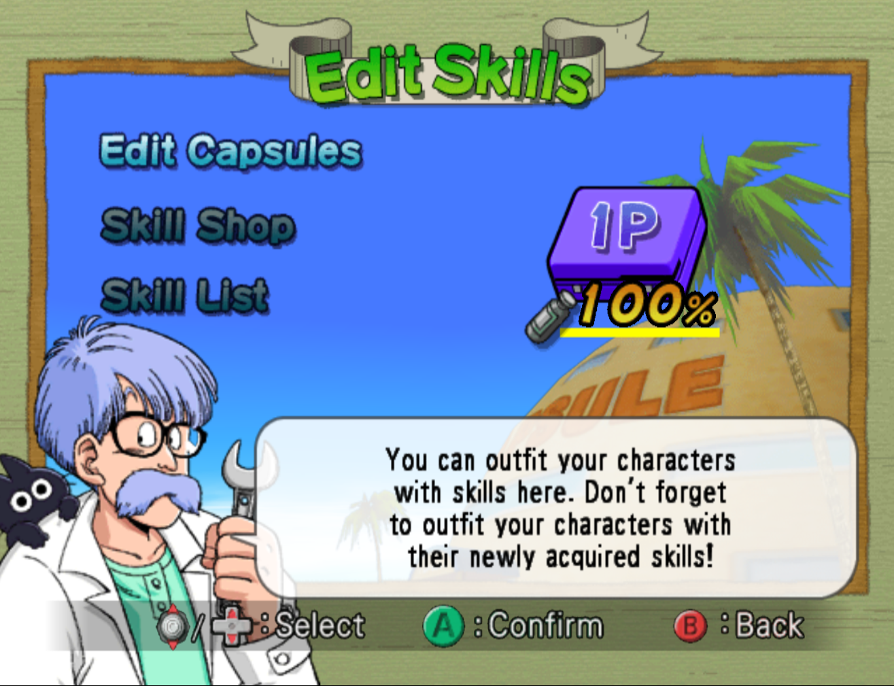
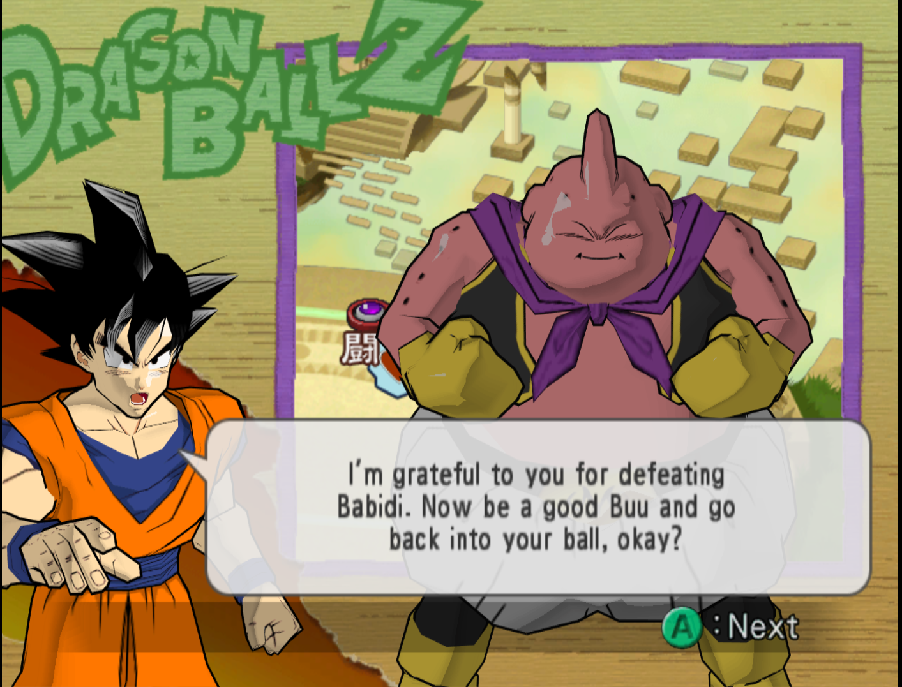
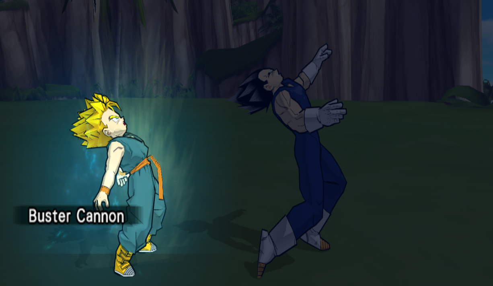
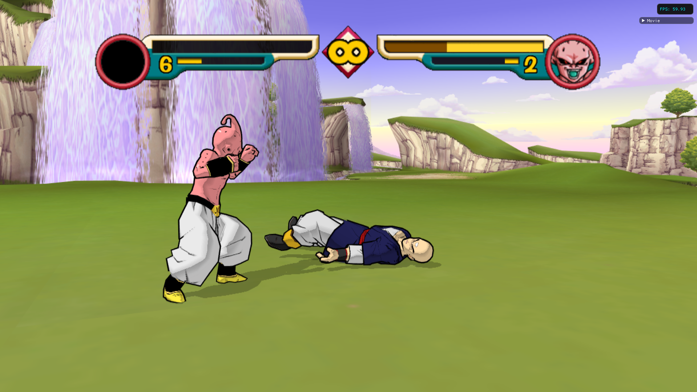
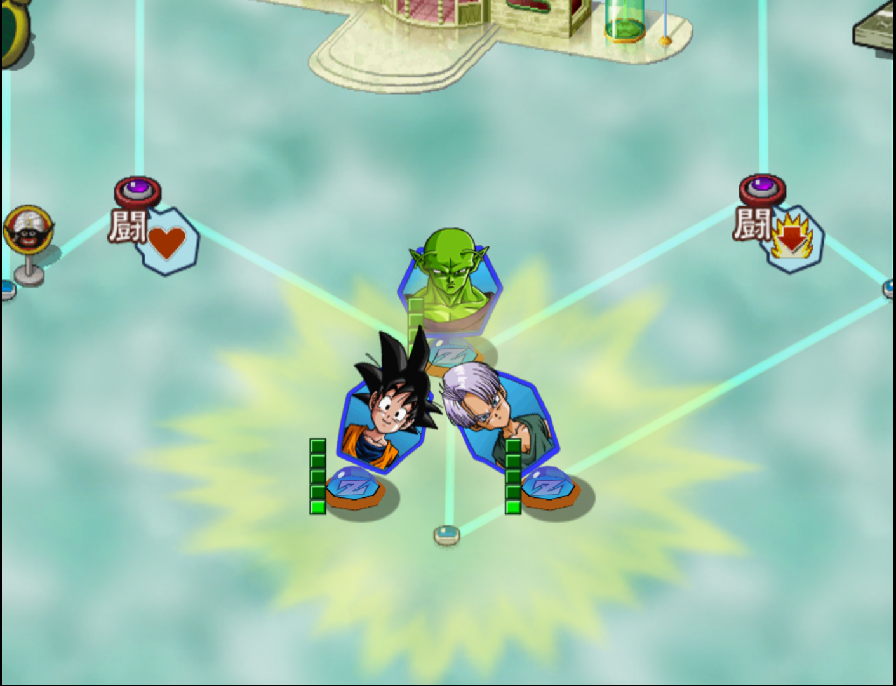
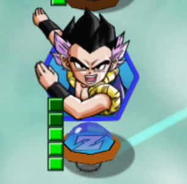

# Dragon Ball Z: Budokai 2

## General Information

- Platform: GameCube (Dolphin Emulator)
- Ownership: Owned, physical GameCube copy.
- Played Time: 41 hours (to complete)
	- Time to beat: 3 hours, 25 minutes. 
	- Date: 2022-04-13
- Achievements: n/a
- Rating: 4/10
- [Backloggery](https://www.backloggery.com/games.php?user=QueenRaven29&search=Dragon+Ball+Z%3A+Budokai+2)

## Summary
This was one of the handful of childhood games I put on my backlog to really see to the end, based on how much of a good time I had with them when I was younger. There are tons of ups and downs when it comes to this game. Although I haven't played a lot of fighting games, this is one of the few games I've played that has a unique feeling single player story. Other than that, the longer I played this game, and the longer I went for full completion, the more and more I disliked it. 

## First Impressions
As stated before, I'm no stranger to this game. My first impressions of this game are heavily clouded in nostalgia. While there's a handful of options on the main menu, there are only two ways to play this game. Dragon World, and World Tournament. During my first Dragon World playthrough, I had a great time. A ton of nostalgia and eureka moments seeing what I remember came rushing back to me. Unlocking new abilities via capsules, and unlocking new characters by doing certain things that are in line with the lore of Dragon Ball. 

Dragon World is a board game styled format, where you move your characters around the map, and then it drops you into a battle screen. I'm not sure of any other games that do it like this, but this is what really hooked me into the game, as someone who only has played Melee as their fighting game of choice. You can find buffs, capsules, and money above and underground. Something I didn't know about Dragon World as a kid, is that it has difficulties. No wonder I found the game so easy as a kid. They range from way too easy, to make the game extremely unfair. I stuck to the middle option, as there's no reason to play on any of the insane difficulties, other than hating yourself. 

## Getting Into It
Regarding Dragon World after playing it a few times, playing through this once or twice is the best way to experience this game. It's fun to discover where things are and how you combine your teammates to make your character as strong as possible. Once you beat Dragon World once, collecting all the Dragon Balls throughout, you get to make a wish for something special. The usual options are some kind of capsule or outfit, but the first thing everyone gets is an extra mode - Babadi's Spaceship.

Babadi's Spaceship unlocks four mini-games that you can play to unlock capsules and even some new characters related to Babadi. The mini-games are very... okay. Not the most engaging and won't hold your attention for too long, but a decent addition to the game. I decided to turn on my turbo control and exploit one of the volleyball mini-games, since I've done these hundreds of times as a kid. I never liked them, but 10% of the capsules are locked behind this extra mode.

## Final Thoughts
After beating Dragon World a few times, I begin to get bored with that, and tried to get as many capsules as possible using the final game mode I haven't talked about - World Tournament. In this, you get to pick between three difficulties. The higher the difficulty, the more money you get for winning. There's also capsules that you can use to increase your money gain at the sacrifice of not having any abilities. 

The tournament itself is an arena style fighting ring, where you need to beat, or knock the other person out of the ring. If you go the full money route, you'll most likely need to knock them out of the ring, since you don't have any capsule abilities. I did this for... many hours, grinding out money. I used that to go to the capsule shop and purchase all the capsules I didn't have. On the topic of capsules...

The game is extremely inconsistent with conveying information. In some modes, you can read what capsules do, while in others, you can't. This is particularly annoying in World Tournament mode, where you need to customize your character each time. Furthermore, while a ton of characters have the same ability, they all do them at different speeds. Some do the ability so slowly, that it can be instantly blocked by the opponent. 

## Completion
I strongly advise against attempting this. You have to playthrough the story mode 42 different times MINIMUM. There's no clear indication of what you missed, so you'll be retracing your steps doing the same thing over and over again with no clear indication of if what you're doing is correct. You should play more than just beating it, but I wouldn't get too crazy with it. At most, beat the game on hard, play the mini-games in Babadi's Spaceship a handful of times, and do a World Tournament on Adept with all of your favorite characters. Don't try to get all the capsules, and certainly don't play the game on Z or ZZ. 

## Media Gallery

This game had some pretty funny dialogue.

***

Father vs. Son

***

Who would have thought that Tien wasn't going to be able to beat Kid Buu?

***

The fusions in this game were really hard to pull off, but super strong. This one, they just gave to you for free. In other circumstances, you had to pull off really hard combos. 

 

***
Return to: [[Homepage]](/index) [[Games]](/Games/Home) [[GameCube]](/Games/GameCube/Home)