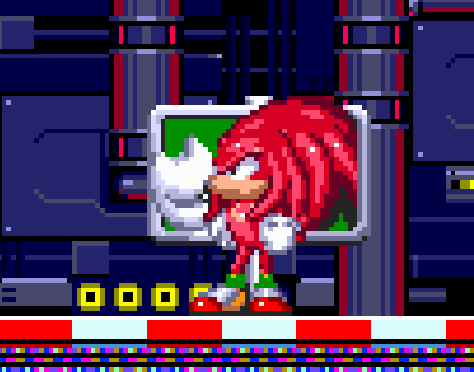
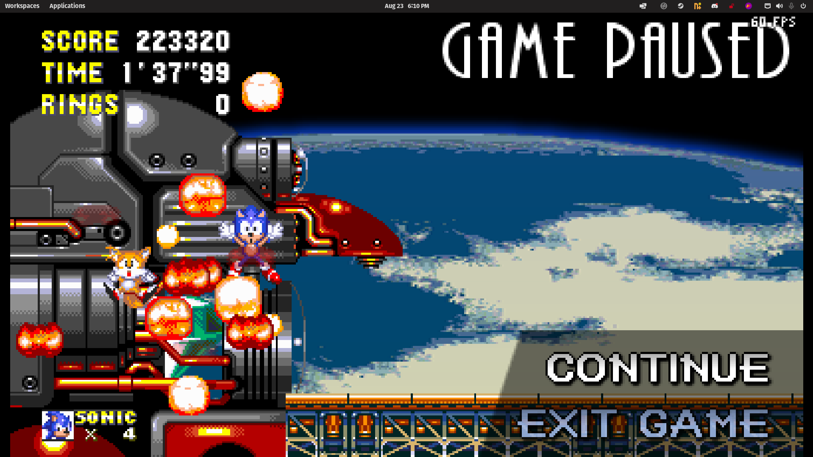

# Sonic the Hedgehog 3 & Knuckles

## General Information

- Platform: Linux, [Angel Island Revisited](https://sonic3air.org/).
	- Originally: Sega Genesis
- Ownership: Owned on [Steam](https://store.steampowered.com/app/34270).
- Played Time: 25 hours, 31 minutes (to complete)
	- Time to beat: 6 hours, 24 minutes
	- Date: 2022-06-25
- Achievements: 18/18
- Rating: 9/10
- [Backloggery](https://www.backloggery.com/games.php?user=QueenRaven29&search=Sonic+the+Hedgehog+3+%26+Knuckles)

## Summary
I couldn't stomach setting up an emulator for this experience, and I believe Sonic 3 A.I.R. to be the definitive way to play the game currently. The plethora of settings you're given makes this game unmatched. 

This game is a massive step up from Sonic 1, 2, & CD. Everything is better, from the gameplay, to the sound, to the level design. The levels still do have their flaws, which goes with the nature of when this game was made.

## Gameplay

On my first version of this review, I had a written breakdown of each level. The more I played the game, and the more I read through my thoughts on them, I found myself disagreeing with myself. I think describing each level would be a huge disservice to anyone looking at this, or even anyone reviewing this game. Every level is unique in its own way, naturally. You can find something to love about each level, but you’ll also find something that irritates you. Each play through will iron out your feelings towards the game. If you love platformers, this is a quintessential play.

## Difficulty
### **Sonic & Tails**
This is the default experience. I underutilized Tails, but it doesn't feel like I missed anything substantial by not using her. I killed bosses faster, but she got me killed a few times due to hitting the boss before me, and hit stun. Gifts and curses, I suppose. 

### **Sonic**
Pretty standard. You aren't going to reach any of the special things that you need to have/be Tails to get, but out of sight, out of mind, right? 

### **Tails**
Playing as Tails made the game so easy, but I found this play through the most fun. I was able to use my knowledge of the game up until this point, as well as her amazing mobility, to play the game in the most overpowered way possible. I had a great time with this one. 

### **Knuckles**
When I was a kid, I had no idea that Knuckles levels were remixed versions of the original levels. I thought they were the same levels, but you played as Knuckles. I quickly learned that, no only were they remixed, they were much more difficult. During my first play through with Knuckles, I got repeatedly irritated with the design of the levels. The bosses were also harder, shooting out more projectiles than their Sonic & Tails counterparts. The final boss, however, was much easier than the original Death Egg fight with Eggman. 

### **Knuckes & Tails**
The second play through was done in less than two hours. After playing so much of the game, all the difficulty I faced in the previous Knuckles play through, was completely void.

## Completion
I absolutely recommend going for full completion of this game. It takes less than 30 hours to do, and seeing yourself get better to achieve those completed saves make you feel good. When I started, I thought I was just going to beat the game and call it there. I ended up not only completing the game, but went back and did a bunch of time trials to see how fast I could beat each level. As I said in the gameplay section, this is such a fun experience, even if you aren't a mega platformer fan. 

## Media Gallery

Showing all completed play throughs, and all achievements. 

<video src="https://raw.githubusercontent.com/sapphic-wallflower/into-the-void/gh-pages/Linux/Assets/Sonic3-100.mp4" controls="controls" style="max-width: 730px;">
</video>

* * *

Funny big head Knuckles. Sign dropped on my head.

* * *

A lot of the time, Tails would go in and hit the boss before me, making me fall to my death. 

* * *
## Return to: [Homepage](/index) - [Games](/Games/games-index) - [Linux List](/Linux/linux-index)