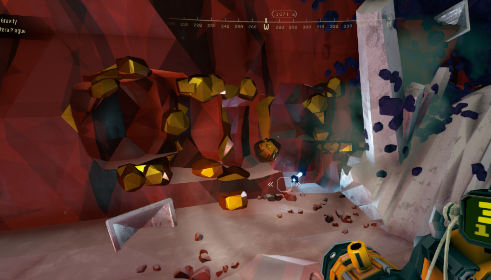
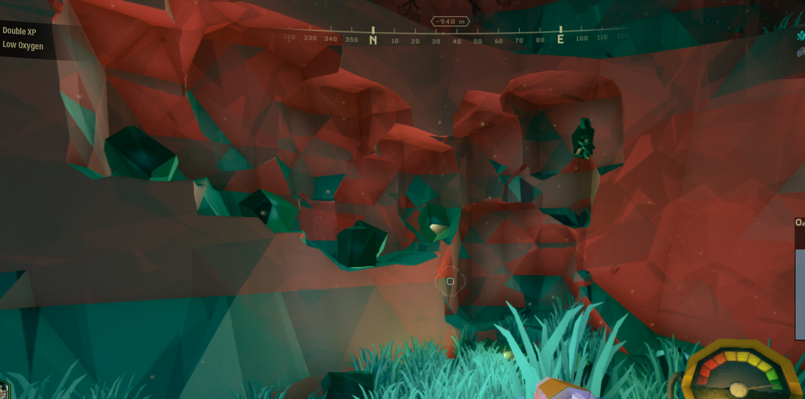
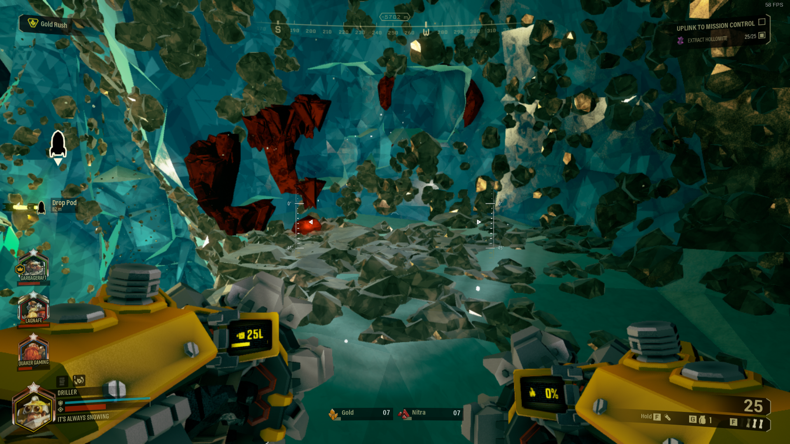
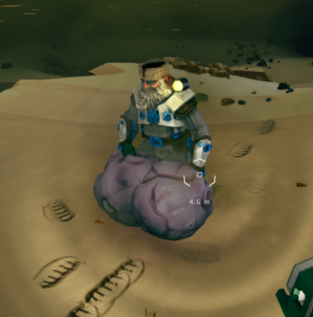
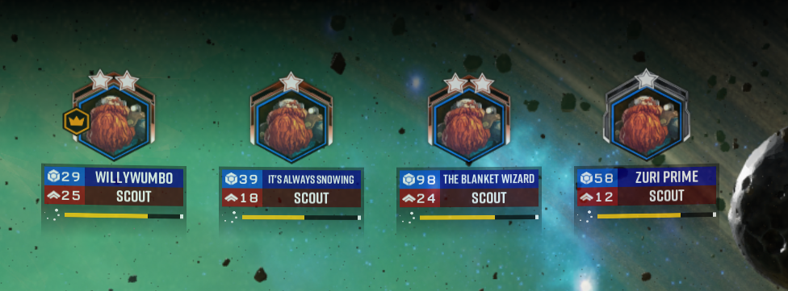
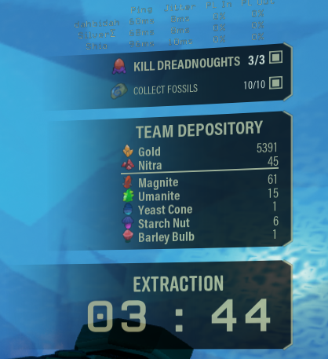

# Deep Rock Galactic

## General Information
- Platform: Steam
- Ownership: Owned
- Played Time: 389 hours (for all achievements), 860 hours (overall, and counting!)
	- Time to beat: n/a
	- Date: 2022-02-02
- Achievements: 69/69
- Rating: 10/10
- [Backloggery](https://www.backloggery.com/games.php?user=QueenRaven29&search=Deep+Rock+Galactic)

## Summary
One of my friends, Felicity, got me into this game. She suggested I give a shot and play it with her, after we were talking about multiplayer games, and achievements one day. This very well could have ended up being Payday 2, but I suppose I'm glad it's not. It's become one of my favourite multiplayer games of all time, most likely edging out Halo. 

## First Impressions
Loading into Deep Rock for the first time, you'll be greeted with the tutorial for the game. I think the tutorial could do a bit better at explaining some things, but you'll pick it up pretty quickly. I didn't know where to go at the start, and just started digging into the wall. Don't be like me. 

Once you've completed that, you'll be dropped into the Space Rig. This is the hub for the game. From here, you'll be able to pick your mission, choose your assignment, customize your character and weapons, and check out some neat mini-games for when your friend is taking an extra long time "making food". There are a bunch of secrets to find, so check every new place between games. 

## Getting Into It
Delving into the combat aspect of the game, there's a lot more to say. The four classes of the game all have their unique role. The game is so finely balanced around these classes, I'd be personally shocked if they could add a new class without drastically altering something. Each class gets three primary weapons, three to four secondaries, and three grenades. These tools, along with overclocks - a way to modify your base weapons - will allow people to experiment with thousands of different weapon combinations to refine their play. 

What good are weapons without maps to play them on? Every map that you load will be different. Some mission types have templates, meaning that some might look the same, but they'll always play out differently. With modifiers on maps, random generations/seeds, machine events, and the plethora of weapons you get, you could get lost in this game for thousands of hours.

There are five difficulties in the game, known as hazards. You can go from hazard one, up to hazard five. For the first two, I wouldn't recommend anyone play on these difficulties, aside from your first few games. Because this is a PvE game only, you're essentially doing nothing but mining. Very little enemies spawn, and when they do, they fall over pretty quickly. Hazard three is great for getting your bearings in the game, as well as playing casually in the background with friends. The game feels like it was meant to be played here. 

Moving up to hazard four, you need to start focusing here. Enemies are faster, stronger, and you can quickly get swarmed and go down. Much like hazard four, hazard five follows the same idea. Stronger, faster, smarter enemies. The main difference here, is that if you mess up even once, you're dead. You have to be playing your best at all times, or you're going to slow down your team, or just straight up lose. Hazard four and five feel very rewarding to play if you can make them your main difficulties; the bonus rewards you get for playing them make it feel worth it when you lose once in a while.

## Final Thoughts
As I said before, Deep Rock has become my favourite multiplayer game of all time. With all the build combinations in the game, you can make every drop feel different. I don't think I'll stop playing this game any time soon. It's become my comfort game that I load up and play whenever I find myself rotating between social media. 

The game is easy enough to where you should be able to carry every game with every build once you've mastered every class. Unfortunately, it's open matchmaking, so people who aren't good at the game can join you. I found this to be the case a majority of the time for me, as I ended up carrying every game. Every time I wanted to try something new, I would end up losing because of the difficulty scaling with more people. I didn't want to drop the difficulty down, and I didn't want to kick everyone I thought was bad based on how many hours they have in the game, so I stuck with my core builds, almost never trying something new. 

## Completion
It's hard to suggest sitting down and completing this game. I would say that if you're really dead set on completing it (all achievements), I'd recommend you not focus on doing the final achievement. The final achievement essentially requires you to play every class and promote them seven times. Obviously, it took me almost 400 hours to do that, and I was really focusing on the double experience missions. There's also some dispute between what completion actually is. For a sane person, it would be getting all the achievements. For the more insane, you'd want to go for all cosmetics, which would most likely take you well into the thousand-hour mark. The cargo crates have a ton of content in them, plus getting all the weapon modifications seems endless. It's also a game that's still getting constant updates. They haven't ever added more achievements, but they will almost certainly be consistently adding more cosmetics. Truly a task for the insane to keep up with all of that.

## Media Gallery

I always hated it when people did this. When I first started playing, I thought it was funny. 500 hours in, I find myself cleaning up after everyone like I'm their mom or something.

* * *

Gump Balls.

* * *

Why yes, I am an adult. 

* * *

Remember to have fun once in awhile, it's still a video game. 

* * *

To date, this is the most gold I've ever gotten in a single game.

***
Return to: [[Home]](/index) [[Games]](/Games/Home) [[Steam]](/Games/Steam/Home)