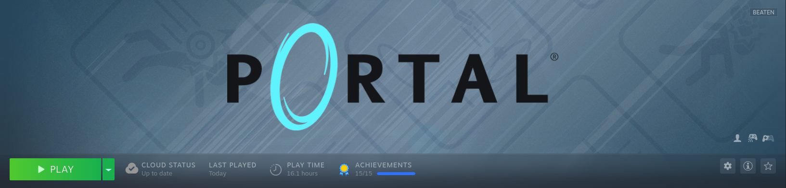

# Portal

## General Information
- Platform: Steam
- Ownership: Owned
- Played Time: 6 hours (to complete)
    - Time to beat: 1 hour, 51 minutes.
    - Date: 2022-03-05
- Achievements: 15/15
- Rating: 4/10
- [Backloggery](https://www.backloggery.com/games.php?user=QueenRaven29&search=Portal)

## Summary
I don't have much to say about this game. It's certainly a video game? It was a very short and middling experience.

## Gameplay
It's a puzzle game through and through. Without playing Portal 2, it feels like this is a very long tutorial for that game. You can tell there's some charm there, but it doesn't hit that much.

## Difficulty
It feels like a tutorial for another game. All the puzzles feel like they're all extremely easy, and none of them took much thought to complete. The advanced modes should have been what the default game was; those were actually fun and challenging. Most of the difficulty comes in the challenges, which I'll talk about in the completion section.

## Completion
The achievements in this game are a mess. Sometimes, they simply don't work. I tried to get a few of them multiple times, and it wouldn't register. You'll get them all eventually if you want them, but achievements not registering are the bane of any completionist. The other achievements in the challenge mode are categorically not fun. I haven't talked to anyone at this point who's enjoyed doing them. The speedrun challenges are okay until they expect you to utilize glitches to complete them. There's no way you'd know about these glitches unless you go out of the game to look them up, either.

## Media Gallery

* * *
## Return to: [Homepage](/index) - [Games](/Games/games-index) - [Steam List](/Steam/steam-index)