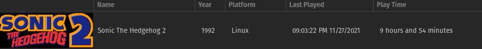
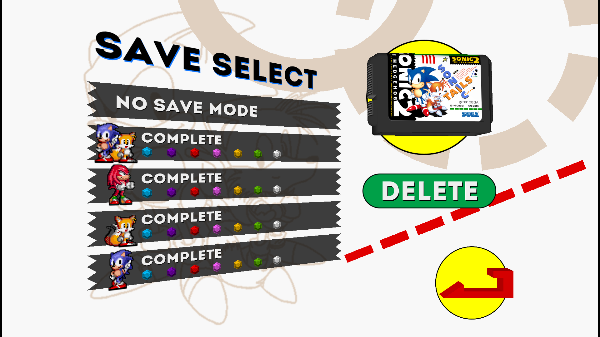

# Sonic the Hedgehog 2

## General Information

- Platform: Linux
	- Originally: iOS (Taxman&Stealth remake)
- Ownership: Owned
- Played Time: 9 hours, 54 minutes.
	- Time to beat: 2 hours, 55 minutes.
	- Date: 2021-11-27
- Achievements: There are achievements, but I couldn't figure out if they were fan-made, or official.
- Rating: 7/10
- [Backloggery](https://www.backloggery.com/games.php?user=QueenRaven29&search=Sonic+the+Hedgehog)

## Summary
To explain the platform, this was the Taxman&Stealth remake. I originally bought this on iOS, but I played it on Linux with the [decompilation](https://github.com/Rubberduckycooly/Sonic-1-2-2013-Decompilation) for Sonic 1, 2, and CD. 

I don't have much thoughts on this game that I didn't already express when talking about Sonic 1. It felt as if it was more of the same Sonic, which is great. The only difference was the special stages, which I prefer to the first variations. 

## Gameplay
It's classic Sonic, there isn't a whole lot of new things to be said about the game. The level design is unique, it's what you'd expect from a classic Sonic game. You have your multi-level gameplay loop, with the top, middle, and bottom levels. Top being easier, but harder to platform, bottom being more enemy dense, middle being a mix of the two. 

## Difficulty
This game was WAY more unfair than the first game. I heard that this version was easier than the original, which I find hard to believe. The game wasn't hard in any sense of difficulty, it was hard in the sense of, they wanted to extend the length of the game by making enemies unfair. It would be as good as Sonic 1 if it weren't for this, which is why I took a point off my rating for essentially the same game. 

## Completion
Completing this game boils down to getting all the chaos emeralds as all four characters. Sonic & Tails, Sonic, Tails, and Knuckles. All this means is you'll be playing the game four times. Each character may be different, but the level layout is the same, and never changes. Do you like the first Sonic game? Do you want an excuse to play the game more? Might as well complete it. Otherwise, maybe check out Sonic CD, 3&K, or Sonic Mania instead.

## Media Gallery

100% save files screen, confirming the completion.

* * *
## Return to: [Homepage](/index) - [Linux List](/Linux/linux-index)