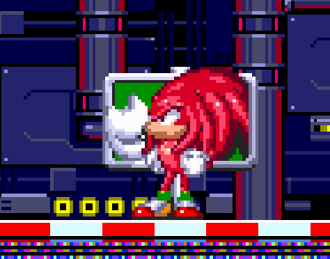
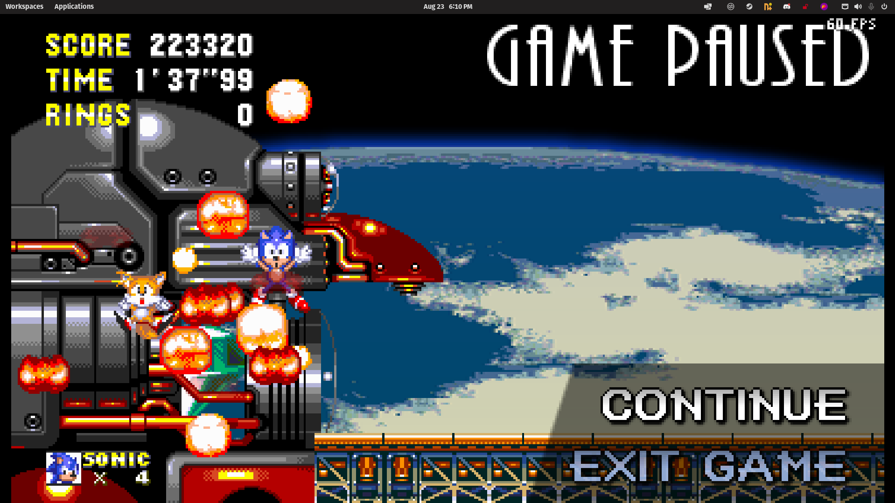

# Sonic the Hedgehog 3 & Knuckles

## General Information

- Platform: Linux, [Angel Island Revisited](https://sonic3air.org/).
	- Originally: Sega Genesis
- Ownership: Owned on [Steam](https://store.steampowered.com/app/34270).
- Played Time: 25 hours, 31 minutes (to complete)
	- Time to beat: 6 hours, 24 minutes
	- Date: 2022-06-25
- Achievements: 18/18
- Rating: 9/10
- [Backloggery](https://www.backloggery.com/games.php?user=QueenRaven29&search=Sonic+the+Hedgehog+3+%26+Knuckles)

## Summary
I couldn't stomach setting up an emulator for this experience, and I believe Sonic 3 A.I.R. to be the definitive way to play the game currently. The plethora of settings you're given makes this game unmatched. 

This game is a massive step up from Sonic 1, 2, & CD. Everything is better, from the gameplay, to the sound, to the level design. The levels still do have their flaws, which goes with the nature of when this game was made. A note for my levels reviews, they were all my first impressions. 

## Gameplay

### **Angel Island Zone**
The gameplay is very smooth. It's a great intro level that teaches you the core mechanics of the playforming in Sonic 3&K. High path, mid path, and low path, all sprinkled with enemies, powerups, and obstacles. Every time I had to play through this level, I would push myself more and more to see how fast I could complete the level while finding the big rings. 

### **Hydrdocity Zone**
It wouldn't be a video game from the pre-2000s era if it didn't have a water level. That's all there is to say; it's a water level. The most notable thing to say about it, is that they manged to make the unique enemies match the atmospheric indoor theme it has. It's a very bearable water level, it has a good mix of above and underwater. Also, it's pronounced "Hydrocity". 

### **Marbel Garden Zone** 
This whole level is a mess. I can't stand having to go through this each time. You think there's going to be these multi-level paths, but it feels like a child made this level in a level builder. You run all over the place with no real direction, and you just happen to end up at the end. It's made even worse by the arrow signs that will point in two different directions, and one of them might be wrong. I get that the level shifts based on what you do, but if you need to drop signs to tell people which way you *might* be going, you're doing something wrong from the start.

### **Carnival Night Zone**
It's pure fun. It's straight up fun. The music is so nice to listen to on repeat. Running around, hitting the balloons, bouncing into the spheres, launching off the barrels. You can find some very well hidden secrets areas simply by having fun in the game.

### **Icecap Zone**
It's a *cool* idea for a stage, but could have used a more work on it. The opening of Act 1 is so epic, but it leads to repetitive gameplay. It takes elements from a previous Sonic game, which were immediately noticeable. Aside from that, it's a gorgeous stage, with very well composed music. The snowboarding section of Act 1 really stands out, but the rest of both acts are criminally inoffensive. I wish this level was more spectacular.

### **Launch Base Zone**
A miserable experience where Michael Jackson won't stop telling you to go. The track is great if you don't get stuck on this level for 20 minutes, but you will. I somehow found a way to softlock myself, and had to restart from a previous checkpoint. 
This is only something that happened to me the first time. On later playthroughs, this level was decent. Slightly confusing at times, but a fun level overall.

### **Mushroom Hill Zone**
This level is cute. It has a cute atmosphere, cute enemies, cute backgrounds; everything is just adorable. The difficulty between Launch Base Zone and this is so different, that you'll most likely end up blowing through this level and not really taking it in. Make sure you go back and take it slow on your second play through. 

### **Flying Battery Zone**
I forgot everything about this level. It came and went so fast, that I almost don't remember what it looks like. If I didn't play this level more than once, I'd have forgotten it was in the line-up. That doesn't mean the level is bad, it's just an inoffensive level. It doesn't have anything memorable, but it doesn't feel like padding at the same time.

### **Sandopolis Zone**
This is the first level I rage quit on while playing. In fact, it made me take a week break from my first playthrough. The first act was okay, but the second act was confusing for me to navigate. There's mini-puzzle where you have to jump across sand streams, but I kept getting stuck in an endless loop. After I came back and played it again after my week break, I beat it on my first try with no real problems. I wonder what I did differently? 

### **Lava Reef Zone**
It was a cute zone that had amazing flow. I came and went through this level faster than any other level in the & Knuckles portion of Sonic 3. For the first time, I feel like getting hit, or running fast into something felt like it was my fault. Not some cheap trick to make you lose all your rings under the guise of "play it again, you'll do better on your second play through. The theme was cool, and the two bosses were cool. Although, the first boss died so fast because of the fire shield I had, I didn't get to see what it's attacks were.

### **Hidden Palace Zone**
I wasn't aware this was going to be such a short level. The only thing you do is collect some coins, then beat up Knuckles. I must say, the fight with Knuckles was pathetic. Knuckles had been a pest through the entire game, and this is the final boss fight, followed by you two just being friends? Meh.

### **Sky Sanctuary Zone**
I LOVE this level. You revist bosses from past games in the form of Metal Sonic coming to attack you. Levels like this get a bad rap, but the music was great, the level design was great, and all of the bosses translated well from the prior games. I felt a bit of happiness playing this level, it's one I could go back to and play multiple times.

### **Death Egg Zone**
It's a very standard level, and is pretty enjoyable. You can farm a lot of lives and rings here without trying to. After you finish the level, you're met with four phases of a single boss, back to back to back. If you die once, you lose all your rings and are forced to go on a no-hit run. When I did this boss for the first time, it knocked out all of the 8 continues I had saved up, and my 12 lives I had left after the level. Some of my deaths left my with my mouth wide open, and made me feel like I never played a video game before. The second time I did this boss, it was way easier, but my first time was brutal.

### **Special Stages (Sonic 3)** 
They are fun. They're quite simple, but the complexity ramps up towards the later emeralds. Still, you should be able to do these without missing any.

### **Special Stages (& Knuckles)**
I don't understand, some of these are insanely hard, some of them are just walk in a straight line with extra steps. I have mixed feelings about them, I wish I knew more about why they made them this way. There's no way you'll get them all on your first try.

## Difficulty
### **Sonic & Tails**
This is the default expereience. I underutilized Tails, but it doesn't feel like I missed anything substatial by not using her. I killed bosses faster, but she got me killed a few times due to hitting the boss before me, and hitstun. Gifts and curses, I suppose. 

### **Sonic**
Pretty standard. You aren't going to reach any of the special things that you need to have/be Tails to get, but out of sight, out of mind, right? 

### **Tails**
Playing as Tails made the game so easy, but I found this playthrough the most fun. I was able to use my knowledge of the game up until this point, as well as her amazing mobility to play the game in the most overpowered way possible. I had agreat time with this one. 

### **Knuckles**
When I was a kid, I had no idea that Knuckles levels were remixed versions of the original levels. I thought they were the same levels, but you played as Knuckles. I quickly learned that, no only were they remixed, they were much more difficult. During my first playthrough with Knuckles, I got repeadedly irritated with the design of the levels. The bosses were also harder, shooting out more projectiles than their Sonic & Tails counterpart. The final boss, however, was much more easy than the original Death Egg fight with Eggman. 

### **Knuckes & Tails**
More or less the same thoughts as above. Second play through as Knuckles was easy, and Tails mostly just got in the way.

## Completion
I can see the appeal of wanting to complete this game. It has a clear direction of what 100% would look like, esepcially if you play A.I.R.. It's hard for me to recommend it personally, as this game sat on my backlog for so long, it kept me from playing anything else. This is mostly a me problem, but if you can't start a game until you finish the previous, and you're not a die hard platformer fan, you might consider beating this and moving on. I slowly chipped away at this until I completed it, which took me a few months. The sheer scope of this game is daunting, since it's two games built into one. 

## Media Gallery

Showing all completed play throughs, and all achievements. 

* * *

Funny big head Knuckles. Sign dropped on my head.

* * *

A lot of the time, Tails would go in and hit the boss before me, making me fall to my death. 

* * *
## Return to: [Homepage](/index) - [Linux List](/Linux/linux-index)