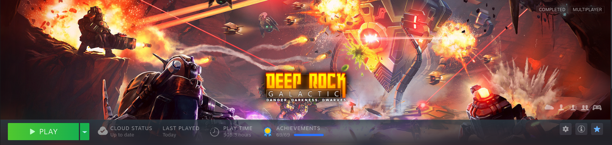
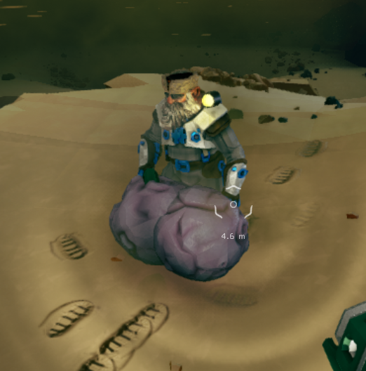

# Deep Rock Galactic

## General Information
- Platform: Steam
- Ownership: Owned
- Played Time: 389 hours (for all achievements), 680 hours (overall, and counting!)
	- Time to beat: n/a
	- Date: 2022-02-02
- Achievements: 69/69
- Rating: 10/10
- [Backloggery](https://www.backloggery.com/games.php?user=QueenRaven29&search=Deep+Rock+Galactic)

## Summary
This game has easily become my favorite online multiplayer game of all time. It's extremely fun, no matter what you end up doing. If you want to play alone, with friends, or with a bunch of random people. The dynamics between all the settings, levels, weapons, and weapon modifiers make every drop unique and fun to play.

## Gameplay

Loading into Deep Rock for the first time, you'll be greeted with the tutorial for the game. It's been a long time since I've seen that tutorial, but I remember it getting the job done well enough for a new player. 

Once you've completed that, you'll be dropped into the Space Rig. This is the hub for the game. From here, you'll be able to pick your mission, choose your assignment, customize your character and weapons, and check out some neat mini-games for when your friend is taking an extra long time "making food". There are a bunch of secrets to find, so check every new place between games. 

Delving into the combat aspect of the game, there's a lot more to say. The four classes of the game all have their unique role. The game is so finely balanced around these classes, I'd be personally shocked if they could add a new class without drastically altering something. Each class gets three primary weapons, three to four secondaries, and three grenades. These tools, along with overclocks - a way to modify your base weapons - will allow people to experiment with thousands of different weapon combinations to refine their play. 

What good are weapons without maps to play them on? Every map that you load will be different. Some mission types have templates, meaning that some might look the same, but they'll always play out differently. With modifiers on maps, random generations/seeds, machine events, and the plethora of weapons you get, you could get lost in this game for thousands of hours.

<b>Would you like to know more?</b>

 
<h3><b>Space Rig</b></h3>
The space rig is home to everything you do outside of the combat portion of the game. You can choose your mission, view your dailies, pick your assignment, customize your weapon's loadout, buy and dress your dwarf with cosmetics, and view the mineral market. There's also a bar, where you can buy a brew that'll give you a silly effect, or even buff your character going into the next mission. Those buffs can be anything from making your pickaxe stronger, to carrying heavy objects, to increasing your health. Aside from that, there's mini-games you can do as well, which are tied to a couple of achievements. 

 
<h3><b>Assignments</b></h3>
During your first 100 levels in the game, you'll get consistent assignments to unlock cosmetics and new weapons. After a while, you'll stop getting new assignments for those, and you'll only get two for your weeklies, and then every time you need to promote your character. There isn't much to say about them. I haven't really seen any of the early ones for a long time now, but they're a great tool for easing a new player into the weapons.

 
<h3><b>Weekly Challenges</b></h3>
Every week, you'll get access to assignments that'll give you blank matrix cores to unlock overclocks. There's also deep dive, and an elite deep dive. They're essentially three missions back to back that carry Nitra from the last match onto the next. Each drop increases the difficulty, so you'll need to preserve your Nitra as best you can, so you don't run out when things get tough. The normal deep dive is quite easy. It's mostly a time sink once you get better at the game. The elite deep dive poses the most challenging task in the game, and you have to do it weekly. The other two weeklies are assignments that give you some cores, and materials. I assume these are for people who don't have time to commit to the deep dives, but want to get some bonuses each week too.

 
<h3><b>Classes</b></h3>
All the characters in the game have an important role to play, that only they can accomplish. Some people will say that “X class is underpowered”, and “Y class is overpowered”, but after playing them all for an equal amount of time, I found myself saying “Wow, I really wish I was playing WXYZ class”. They're extremely well-balanced, and when you find that right character for you, it'll feel like they can do anything. It's a fun bit of exploration, and I encourage you to play every class. Don't get stuck in the one-trick pony camp until you've got a ton of hours under your belt.

 
<h3><b>Weapons</b></h3>
I have the same opinion about weapons. Everyone can get really opinionated about what's best, what isn't great, etc. but all the weapons in the game can fill a very specific role or just feel fun for you to play with. Even at the highest level of play, there isn't a weapon that can't deal with whatever the game throws at you, especially with the right weapon overclock. An overclock is a modifier to your weapon you can unlock doing various things. They can completely change how the gun feels, what it does, or just give a simple upgrade to the ammo count and damage. There are so many overclocks to find and experiment with. They aren't all created equal, but there aren't any that'll just make the weapon unusable. Again, don't get stuck in a mindset of “This is what I will use forever, I will never use anything else”. Please experiment with weapons and the overclocks that go with them. You'll have such a better time playing the game.

 
<h3><b>The Map</b></h3>
This is where you'll be able to see all the available missions. There are eight zones, but only five are available. They rotate every 30 minutes. From here, you can see what type of mission it is, what modifiers they have, and how long & complex they'll be. The game clearly tells you how complex and how long missions are going to be, as well as any modifications to the enemies or bonuses to the world. It can be a nice mix-up in the already ever-changing world of Hoxxes. I won't spoil all the modifiers here because they're fun to explore and learn about on your own, but there's enough to keep the game interesting indefinitely.

 
<h3><b>Events</b></h3>
Once you've dropped into these maps, there's a chance that you'll get some type of bonus events. Those blank cores that you've been getting from the weeklies can be cashed in after completing these events. You put a key into the matrix infuser, and it'll activate the event. There are a few different types, so keep an eye out as you play. Aside from those, there's also rare enemy spawns, such as the bulk detonator, and the prospector. In the future, there will be even more events, but at the time of writing this, those are the majority that you'll find. You'll always want to do these, as they give bonus loot, bonus experience, and even weapon modifications in the form of overclocks.

 

## Difficulty

There are five difficulties in the game, known as hazards. You can go from hazard one, up to hazard five. For the first two, I wouldn't recommend anyone play on these difficulties, aside from your first few games. Because this is a PvE game only, you're essentially doing nothing but mining. Very little enemies spawn, and when they do, they fall over pretty quickly. 

Hazard three is great for getting your bearings in the game, as well as playing casually in the background with friends. The game feels like it was meant to be played here. 

Moving up to hazard four, you need to start focusing here. Enemies are faster, stronger, and you can quickly get swarmed and go down. Much like hazard four, hazard five follows the same idea. Stronger, faster, smarter enemies. The main difference here, is that if you mess up even once, you're dead. You have to be playing your best at all times, or you're going to slow down your team, or just straight up lose. Hazard four and five feel very rewarding to play if you can make them your main difficulties; the bonus rewards you get for playing them make it feel worth it when you lose once in a while. 

## Completion
It's hard to suggest sitting down and completing this game. I would say that if you're really dead set on completing it (all achievements), I'd recommend you not focus on doing the final achievement. The final achievement essentially requires you to play every class and promote them seven times. Obviously, it took me almost 400 hours to do that, and I was really focusing on the double experience missions. There's also some dispute between what completion actually is. For a sane person, it would be getting all the achievements. For the more insane, you'd want to go for all cosmetics, which would most likely take you well into the thousand-hour mark. The cargo crates have a ton of content in them, plus getting all the weapon modifications seems endless. It's also a game that's still getting constant updates. They haven't ever added more achievements, but they will almost certainly be consistently adding more cosmetics. Truly a task for the insane to keep up with all of that.

## Media Gallery

I always hated it when people did this. When I first started playing, I thought it was funny. 500 hours in, I find myself cleaning up after everyone like I'm their mom or something.

* * *

Gump Balls.

* * *

Why yes, I am an adult. 

* * *

Remember to have fun once in awhile, it's still a video game. 

* * *

To date, this is the most gold I've ever gotten in a single game.

* * *
## Return to: [Homepage](/index) - [Steam List](/Steam/steam-index)