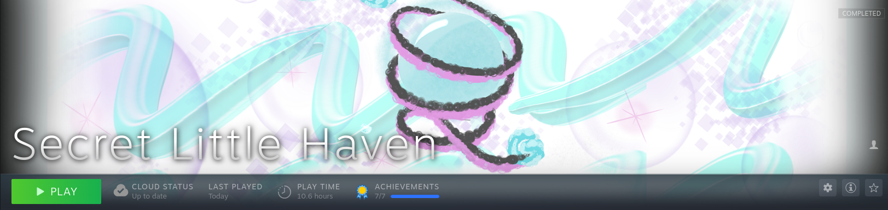
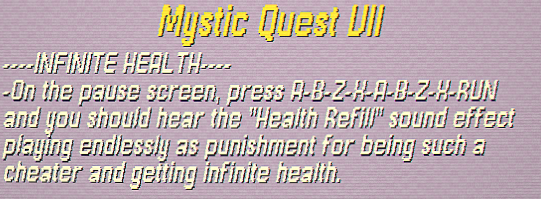
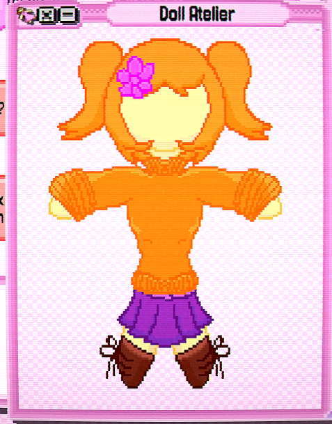
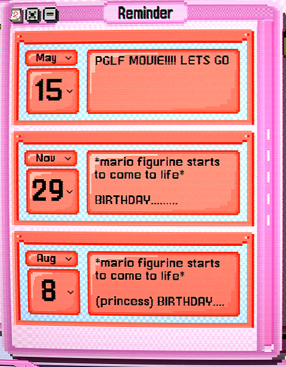
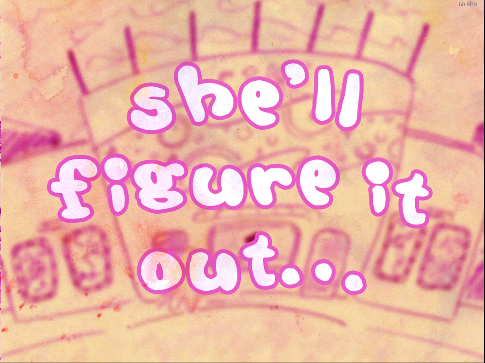

# Secret Little Haven

## General Information

- Platform: Steam
- Ownership: Owned
- Played Time: 10.6 hours (to complete)
    - Date: 2022-04-11
- Achievements: 7/7
- Rating: 10/10
- [Backloggery](https://www.backloggery.com/games.php?user=QueenRaven29&search=Secret+Little+Haven)

## Summary
This section is typically for the summary, but I'm going to say most of what I want to say about the game here. Trans women need more positive experiences in their life. I will always buy this game for any trans woman who has never played it. It made me so emotional when I played it the first time, and living through other people as I watch them play it makes me feel that same happiness. 

Video games can do a lot for people, and there aren't a great deal of words I can use to describe this. It's more of an emotion, really. You could surround yourself with other trans woman, and never experience the feeling this gives. It's as if something unlocks, the true feeling of "It feels like someone understands me and what I went through." While it'll definitely appeal to people born in the early 1990s, everyone can find something here. 

I wish there was more media like this. I wish we had more happy things in our lives. You only get one childhood, and I envy those who get to live through one. The little things about it not being realistic for the time period, or the ending being too unrealistic should be overlooked. Trans people need happy media. We know what the actual ending would have been like, because we lived it. But we don't need a reminder of that in every piece of media. We can't forget love.

## Gameplay
The entire game is played out through a few basic applications, and a majority through the instant messaging client. There isn't any "true" gameplay, just reading and clicking. 

## Difficulty
If you've only used Windows in your entire life, you're going to have some trouble beating the game. It'll be a good learning experience for you. 

## Completion
The achievements for this game are essentially non-functional. The only way to unlock them is by loading a very early build of the game or using Steam Achievement Manager. Because this game meant so much to me, I was willing to follow a slew of Windows guides while on Linux to load an old build of this game. Needless to say, I do not recommend. Do the achievements normally, and when they don't unlock, just unlock them with Steam Achievement Manager. 

## Media Gallery

A cute little cheat menu I found on a hidden page. There's more to it, but I thought this one was silly.

There's a program in the game that lets you make a doll. This was the first one I made even after many playthroughs.

 

Inside joke I made between my girlfriends in the in-game reminders app.

She'll figure it out.

* * *
## Return to: [Homepage](/into-the-void/index) - [Platform List](/into-the-void/VideoGames/videogame-index) - [Steam List](/into-the-void/VideoGames/Steam/steam-index)