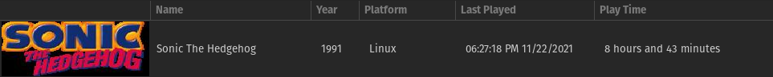
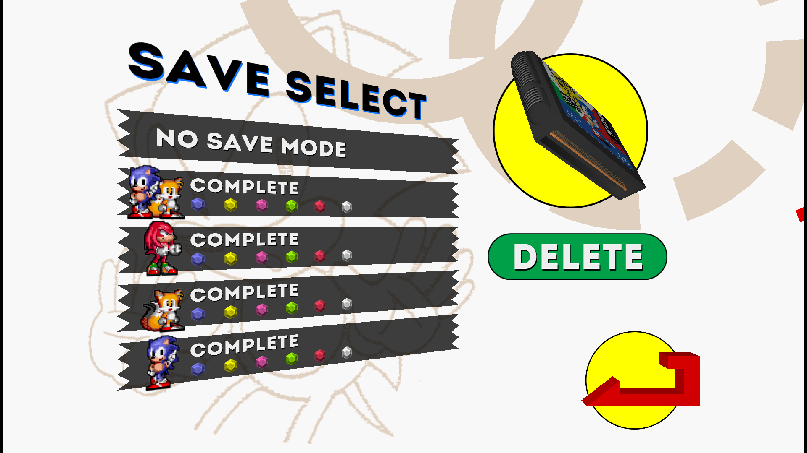

# Sonic the Hedgehog

## General Information

- Platform: Linux
	- Originally: iOS (Taxman & Stealth remake)
- Ownership: Owned on iOS
- Played Time: 8 hours, 43 minutes.
	- Time to beat: 2 hours, 21 minutes.
	- Date: 2021-11-22
- Achievements: There are achievements, but I couldn't figure out if they were fan-made, or official.
- Rating: 8/10
- [Backloggery](https://www.backloggery.com/games.php?user=QueenRaven29&search=Sonic+the+Hedgehog)

## Summary
To explain the platform, this was the Taxman & Stealth remake. I originally bought this on iOS, but I played it on Linux with the [decompilation](https://github.com/Rubberduckycooly/Sonic-1-2-2013-Decompilation) for Sonic 1, 2, and CD. 

This decompilation is the reason I decided to play this game, as well as the others in the decompilation. I added every Sonic game to my backloggery, and away I went. You get to play as all the characters in the Taxman & Stealth version, which is the only real way to play the game as of writing this. 

## First Impressions
It's classic Sonic, except for having the spin dash in this version. It doesn't do much, so I avoided using it. The level design is unique, it's what you'd expect from a classic Sonic game. You have your multi-level gameplay loop, with the top, middle, and bottom levels. Top being easier, but harder to platform, bottom being more enemy dense, middle being a mix of the two. 

## Getting Into It
It can be straight up unfair at times. The way the levels are designed can be painfully obvious they were trying to extend how long it takes to beat this very short game. That's how old games were designed, so how much fault can be attributed here? While unfair, and sometimes frustrating, it maintained its level of being a "frustratingly fun" experience. There are moments that can challenge your ability as a platform player, even up to today's standards.

## Final Thoughts
The game is a bit rough to come back and play, but it's certainly more fun than some other retro games. I had a good time playing this. Ordinarily, I'd have a section here that describes how each level played out, but if I'm being honest, they weren't particularly memorable. The music in this game transcendence the levels. I know the music better than the levels assigned to them, and I hardly listen to video game music. I'm not positive why the levels are so forgettable, but I have no thoughts on them. The same can be said for each character I had to play as. It feels like you could swap out any mascot here, and it would be the same game.

## Completion
Completing this game boils down to getting all the chaos emeralds as all four characters. Sonic & Tails, Sonic, Tails, and Knuckles. All this means is you'll be playing the game four times. Each character may be different, but the level layout is the same, and never changes. Do you like the first Sonic game? Do you want an excuse to play the game more? Might as well complete it. Otherwise, maybe check out Sonic 2, CD, or 3&K instead.

## Media Gallery

100% save files screen, confirming the completion.

***
Return to: [[Home]](/index) [[Games]](/Games/Home) [[Linux]](/Games/Linux/Home)