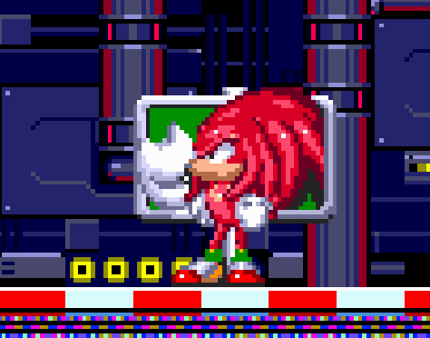

# Sonic the Hedgehog 3 & Knuckles

## General Information

- Platform: Linux, [Angel Island Revisited](https://sonic3air.org/).
	- Originally: Sega Genesis
- Ownership: Owned on [Steam](https://store.steampowered.com/app/34270).
- Played Time: 25 hours, 31 minutes (to complete)
	- Time to beat: 6 hours, 24 minutes
	- Date: 2022-06-25
- Achievements: 18/18
- Rating: 9/10
- [Backloggery](https://www.backloggery.com/games.php?user=QueenRaven29&search=Sonic+the+Hedgehog+3+%26+Knuckles)

## Summary
My girlfriend, Gwen, was very excited for me to start playing this game. Out of the Sonic games before this one, she loves this one the most. She actually helped a lot with my review for this game; not by giving me opinions, but by helping me notice certain aspects of the game after every playthrough.

I couldn't stomach setting up an emulator for this experience, and I believe Sonic 3 A.I.R. to be the definitive way to play the game currently. The plethora of settings you're given makes this version unmatched. 

This game is a massive step up from Sonic 1, 2, & CD. Everything is better, from the gameplay, to the sound, to the level design. The levels still do have their flaws, which goes with the nature of when this game was made.

## First Impressions
The levels are really hard to go through. It feels like there are obstacles in the way just to make you get hit. It's a game based around going fast, yet they want to punish you for going fast? Has Sonic really always been this way? I'm getting flash...backs? to some modern Sonic games. Everything about the game is nice, it's just the level design feels like it was designed to waste your time, since games needed to be artificially long back in the day. I did my first playthrough as Sonic & Tails, and Tails really just existed to get in my way. She got me killed more times than running into random enemies extremely fast did. 

The bosses were pretty easy, and I found them to be interesting. The only real gripe I had was the final boss. It was a two stage boss, where if you died, you had to do a no-hit run essentially. I had no idea how to beat this boss at first, and it blew through the 9 continues, and 38 lives I had built up. I was scared I was going to game over, and I have no idea what that would do. Most likely, it would send me back the act one of the last level, but I didn't want to take any chances. 

## Getting Into It
At this point, I've done two out of the five playthroughs. I'm starting to warm up to the game a lot more, and it's becoming easier to make it through the levels. I can essentially blaze through the levels without getting hit, all while having time to grab all the secrets I've stumbled upon in the first two plays. Some of the bosses still trip me up, but I'm able to do them pretty easily, even with Knuckles, who is supposedly the hard mode of the game. 

The special stages I have locked down, I can complete all of those without failing a single time. I've racked up a ton of extra lives from them, as you get more continues and lives from perfecting the special stages. The same can be said for going through the levels without getting hit, since you get more lives at 100 rings.

I took a detour from the main game to work on some achievements, which I believe are exclusive to Sonic 3 A.I.R. I had to look up video guides for some of them, but they were a fun distraction. There's one where you have to get a million points during a playthrough, and I thought it was going to be extremely hard to do, as my girlfriend who recommended me this game couldn't do it. I found it, it revolves around the special stages, and if you can master those, you'll be just fine. 

## Final Thoughts
On my first version of this review, I had a written breakdown of each level. The more I played the game, and the more I read through my thoughts on them, I found myself disagreeing with myself. I think describing each level would be a huge disservice to anyone looking at this, or even anyone reviewing this game. Every level is unique in its own way, naturally. You can find something to love about each level, but you’ll also find something that irritates you. Each playthrough will iron out your feelings towards the game. If you love platformers, this is a quintessential play.

## Completion
I absolutely recommend going for full completion of this game. It takes less than 30 hours to do, and seeing yourself get better to achieve those completed saves make you feel good. When I started, I thought I was just going to beat the game and call it there. I ended up not only completing the game, but went back and did a bunch of time trials to see how fast I could beat each level. As I said in the gameplay section, this is such a fun experience, even if you aren't a mega platformer fan. 

## Media Gallery

Showing all completed playthroughs, and all achievements. 

<video src="https://raw.githubusercontent.com/sapphic-wallflower/into-the-void/gh-pages/Games/Linux/Assets/Sonic3-100.mp4" controls="controls" style="max-width: 730px;">
</video>

* * *

Funny big head Knuckles. Sign dropped on my head.

* * *

A lot of the time, Tails would go in and hit the boss before me, making me fall to my death. 

***
Return to: [[Home]](/index) [[Games]](/Games/Home) [[Linux]](/Games/Linux/Home)