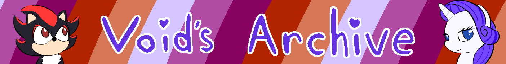

<head>
     <link rel="shortcut icon" type="image/x-icon" href="favicon.ico">
</head>

## About
Thank you for taking the time to check out my website. I don't expect anyone to find this, it'll mostly serve as a way for me to link things to friends instead of screenshotting my notes. It'll also be an extension of my [Backloggery](https://www.backloggery.com/QueenRaven29), since I'm limited in how much I can type there. 

## Groups
- [GameCube](/GameCube/gamecube-index)
- [Linux](/Linux/linux-index)
- [Steam](/Steam/steam-index)

## To-Do List

- [ ] Homepage banner
- [ ] Subgroup banners
- [x] Buy a custom domain to replace the GitHub link.
- [ ] Consider using a dedicated CSS and switch to HTML. 

## Contact
Do you want to get in touch with me? Send me a message on [Twitter](https://twitter.com/jamieofthevoid), and we can figure out where to go from there.

## [Twitter](https://twitter.com/jamieofthevoid) - [Steam](https://steamcommunity.com/id/queenofthevoid/) - [Backloggery](https://www.backloggery.com/QueenRaven29) - [Rate Your Music](https://rateyourmusic.com/~voidgazer_jamie)